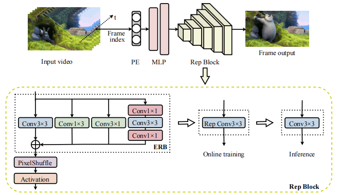

# Boosting Neural Video Representation via Online Structural Reparameterization (PRCV 2025)


Ziyi Li, [Qingyu Mao](https://scholar.google.com.hk/citations?user=SWUKj1MAAAAJ&hl=zh-CN&oi=ao), Shuai Liu, [Qilei Li](https://scholar.google.com.hk/citations?hl=zh-CN&user=BIUlY6AAAAAJ&view_op=list_works&sortby=pubdate), Fanyang Meng, [Yongsheng Liang*](https://scholar.google.com.hk/citations?user=aOEk854AAAAJ&hl=zh-CN&oi=ao).

This is the official implementation of the paper "[Boosting Neural Video Representation via Online Structural Reparameterization](https://arxiv.org/abs/2511.11071)" (PRCV 2025).


## Method Overview
> Our work propose Online-RepNeRV, a neural video representation framework based on online structural reparameterization. Specifically, Online-RepNeRV utilizes ERB that integrates a multi-branch structure during training, and converts it into a single-branch structure after training. This design enhances the model's representational capacity without affecting decoding efficiency.
>
>**Furthermore, our approach can be seamlessly integrated into other convolution-based NeRV models as a plug-and-play component to further enhance their performance.**



## File Structure
```
├── data: each folder in this directory contains a dataset.
│    ├── bunny
│    ├── ...
│    └── beauty
│
├── model.py: implementation of the original and reparameterized model structures.
├── main_train.py: script for model training.
├── main_eval.py: script for model inference and evaluation.
├── read_pth.py: loads and parses checkpoint files.
└── utils.py: collection of helper functions used during training and inference.
```

## Setup Configuration
**Environment:**
* python 3.8, torch 1.8, cuda 11.3
* For more environment configuration information, please see `requirements.txt`.

**Dataset:**

The `'/data'` directory must be in your working directory.
* Download Bunny dataset from [https://studio.blender.org/projects/big-buck-bunny](https://studio.blender.org/projects/big-buck-bunny).
* Download UVG dataset from [https://ultravideo.fi/dataset.html](https://ultravideo.fi/dataset.html).

## Getting started
### Training

* For ```branch_type = NeRV_vanilla```, the model is trained via ```main_train.py``` as shown below. You can adjust the model size by modifying the ```fc_hw_dim```.
```
CUDA_VISIBLE_DEVICES=0 python main_train.py \
    -e 300 --lower_width 96 --num_blocks 1 --dataset bunny --frame_gap 1 \
    --embed 1.25_40 --stem_dim_num 512_1 --reduction 2 --fc_hw_dim 9_16_26 \
    --expansion 1 --single_res --loss Fusion6 --warmup 0.2 --lr_type cosine \
    --strides 5 2 2 2 2 --conv_type conv -b 1 --lr 0.0005 --norm none --act swish \
    --outf bunny_nerv_300 --branch_type NeRV_vanilla
```

* For ```branch_type = ERB```, the model is trained via ```main_train.py``` as shown below. You can adjust the model size by modifying the ```fc_hw_dim```.
```
CUDA_VISIBLE_DEVICES=0 python main_train.py \
    -e 300 --lower_width 96 --num_blocks 1 --dataset bunny --frame_gap 1 \
    --embed 1.25_40 --stem_dim_num 512_1 --reduction 2 --fc_hw_dim 9_16_26 \
    --expansion 1 --single_res --loss Fusion6 --warmup 0.2 --lr_type cosine \
    --strides 5 2 2 2 2 --conv_type conv -b 1 --lr 0.0005 --norm none --act swish \
    --outf bunny_erb_300 --branch_type ERB
```

### Pruning and Quantization

* Using the trained model ```bunny_nerv_300```, you can perform pruning and quantization via ```main_eval.py```. The script loads the latest checkpoint and outputs the evaluation results of the pruned and quantized model, reconstructed images will be saved to ```bunny_nerv_300/visualize```.
The options ```--dump_images```, ```--prune_ratio``` and ```--quant_bit``` are optional.
```
CUDA_VISIBLE_DEVICES=0 python main_eval.py \
    -e 300 --lower_width 96 --num_blocks 1 --dataset bunny --frame_gap 1 \
    --embed 1.25_40 --stem_dim_num 512_1 --reduction 2 --fc_hw_dim 9_16_26 \
    --expansion 1 --single_res --loss Fusion6 --warmup 0.2 --lr_type cosine \
    --strides 5 2 2 2 2 --conv_type conv -b 1 --lr 0.0005 --norm none --act swish \
    --outf bunny_nerv_300 --branch_type NeRV_vanilla --prune_ratio 0.2 --quant_bit 8 
```

* Using the trained model ```bunny_erb_300```, you can perform pruning and quantization via ```main_eval.py```. The script loads the latest checkpoint and outputs the evaluation results of the pruned and quantized model, reconstructed images will be saved to ```bunny_erb_300/visualize```.
The options ```--dump_images```, ```--prune_ratio``` and ```--quant_bit``` are optional.
```
CUDA_VISIBLE_DEVICES=0 python main_eval.py \
    -e 300 --lower_width 96 --num_blocks 1 --dataset bunny --frame_gap 1 \
    --embed 1.25_40 --stem_dim_num 512_1 --reduction 2 --fc_hw_dim 9_16_26 \
    --expansion 1 --single_res --loss Fusion6 --warmup 0.2 --lr_type cosine \
    --strides 5 2 2 2 2 --conv_type conv -b 1 --lr 0.0005 --norm none --act swish \
    --outf bunny_erb_300 --branch_type ERB --prune_ratio 0.2 --quant_bit 8  --dump_images
```

### Pruning with Fine-tuning and Quantization

* Using the trained model ```bunny_nerv_300```, the workflow first perform pruning with fine-tuning, followed by quantization. The script loads the latest checkpoint and outputs the evaluation results of the pruned and quantized model, reconstructed images will be saved to ```bunny_nerv_300/visualize```.
The option ```--finetune``` and ```--finetune_epochs``` are optional, with ```--finetune_epochs``` defaulting to 100.
```
CUDA_VISIBLE_DEVICES=0 python main_eval.py \
    -e 300 --lower_width 96 --num_blocks 1 --dataset bunny --frame_gap 1 \
    --embed 1.25_40 --stem_dim_num 512_1 --reduction 2 --fc_hw_dim 9_16_26 \
    --expansion 1 --single_res --loss Fusion6 --warmup 0.2 --lr_type cosine \
    --strides 5 2 2 2 2 --conv_type conv -b 1 --lr 0.0005 --norm none --act swish \
    --outf bunny_nerv_300 --branch_type NeRV_vanilla --prune_ratio 0.2 --quant_bit 8  --dump_images \
    --finetune --finetune_epochs 10
```

* Using the trained model ```bunny_erb_300```, the workflow first perform pruning with fine-tuning, followed by quantization. The reparameterized model performs pruning with fine-tuning in the training state, the script loads the latest checkpoint and outputs the evaluation results of the pruned and quantized model, reconstructed images will be saved to ```bunny_erb_300/visualize```.
The option ```--finetune``` and ```--finetune_epochs``` are optional, with ```--finetune_epochs``` defaulting to 100.
```
CUDA_VISIBLE_DEVICES=0 python main_eval.py \
    -e 300 --lower_width 96 --num_blocks 1 --dataset bunny --frame_gap 1 \
    --embed 1.25_40 --stem_dim_num 512_1 --reduction 2 --fc_hw_dim 9_16_26 \
    --expansion 1 --single_res --loss Fusion6 --warmup 0.2 --lr_type cosine \
    --strides 5 2 2 2 2 --conv_type conv -b 1 --lr 0.0005 --norm none --act swish \
    --outf bunny_erb_300 --branch_type ERB --prune_ratio 0.2 --quant_bit 8  --dump_images \
    --finetune --finetune_epochs 10 
```
## Citation
If you find our code or our paper useful for your research, please **[★star]** this repo and **[cite]** the following paper:
```
@inproceedings{li2025boosting,
  title={Boosting Neural Video Representation via Online Structural Reparameterization},
  author={Li, Ziyi and Mao, Qingyu and Liu, Shuai and Li, Qilei and Meng, Fanyang and Liang, Yongsheng},
  booktitle={Proceedings of the Chinese Pattern Recognition and Computer Vision (PRCV)},
  year={2025}
  organization={Springer Nature}
}
```

## Contact and Acknowledgement
If you have any questions, please feel free to email the author at qingyu.mao@outlook.com. The implementation is based on the [NeRV](https://github.com/haochen-rye/NeRV) and [OREPA](https://github.com/JUGGHM/OREPA_CVPR2022). We sincerely thank the authors of these pioneering works for providing the foundation upon which our research is built.

